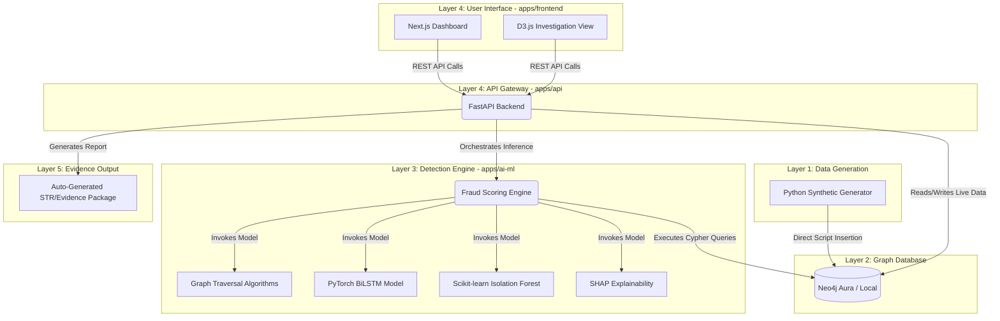

# TRACE-X — Advanced Fund Flow Intelligence & Fraud Detection

## Problem Statement
This project addresses **PS03: Tracking of Funds within Bank for Fraud Detection**. TRACE-X combines Neo4j graph algorithms, PyTorch sequence modeling (BiLSTM), and Scikit-learn anomaly detection (Isolation Forest) to instantly track and flag complex financial crimes like rapid layering, round-tripping, and smurfing.

## Live Demo
🔗 Live Demo: https://tracex.devally.in
🎥 Demo Video: https://youtu.be/ayQX3xO0Hfg

If no live deployment: Run locally using instructions below.

## Tech Stack
*   **Python 3.11**
*   **Neo4j** (Graph Database & Cypher Algorithms)
*   **PyTorch** (BiLSTM for Sequence Smurfing Detection)
*   **Scikit-learn** (Isolation Forest for Dormancy Detection)
*   **SHAP** (Explainable AI / Feature Importance)
*   **FastAPI & Uvicorn** (Asynchronous High-Throughput API Gateway)
*   **Next.js 16+ & React 19** (Frontend Application)
*   **D3.js** (Interactive Graph Visualization)
*   **Tailwind CSS** (UI Styling)
*   **Turborepo** (Monorepo Orchestration)
*   **Faker** (Programmatic Synthetic Data Generation)

## How to Run Locally

### 1. Root Environment Configuration
Create a `.env` file at the root of the project:
```env
NEO4J_URI=neo4j+s://your-instance.databases.neo4j.io
NEO4J_USER=neo4j
NEO4J_PASSWORD=your_password
NEO4J_REL_TYPE=SENT
```

### 2. Install Dependencies
Make sure you have Node > 18 and Python > 3.10.

```bash
# Install root Node dependencies (Turborepo, etc.)
npm install

# Setup backend API
cd apps/api
python -m venv venv
.\venv\Scripts\Activate.ps1
pip install -r requirements.txt

# Setup ML environment
cd ../ai-ml
python -m venv venv
.\venv\Scripts\Activate.ps1
pip install -r requirements.txt
```

### 3. Data Initialization & ML Training
*From the `apps/ai-ml` directory (with venv activated):*
```bash
# Generate high-fidelity synthetic financial data
python data/generate_data.py

# Execute the training pipeline (compiles .pt and .pkl artifacts)
python train_models.py

# Push the topological subset to Neo4j
python load_graph.py --data-dir data/neo4j --clear
```

### 4. Launch Backend API
*From the `apps/api` directory (with venv activated):*
```bash
uvicorn app.main:app --reload --host 127.0.0.1 --port 8000
```

### 5. Launch Frontend Dashboard
*From the `apps/frontend` directory:*
```bash
npm install
npm run dev
```
Open your browser at `http://localhost:3000`.

## Project Structure
*   `/apps/api` — FastAPI asynchronous backend and REST points.
*   `/apps/ai-ml` — Machine learning pipelines, model training scripts, and Cypher integration logic.
*   `/apps/ai-ml/data/generate_data.py` — Engine that programmatically models and injects structural fraud topologies (layering/smurfing).
*   `/apps/frontend` — Next.js 16+ React application featuring D3.js interactive investigations.
*   `/packages/py-schemas` — Shared Pydantic data contracts enforcing strict boundaries across Python microservices.

### Data Flow Architecture



## Dataset
All data is 100% synthetic, generated by our custom engine (`generate_data.py`).

Unlike flat Kaggle CSVs, our dataset programmatically engineers complex fraud network topologies directly into the graph:
*   Account nodes with identities, KYC tiers, stated income, and behavior metrics.
*   Transaction edges with realistic time decay, channel assignments, and values.
*   **Injected Ground Truth:** Specific account rings are deterministically configured to perform Rapid Layering, Circular Wash Trading, and Sub-Threshold Smurfing.

No real banking data was used.

## Model Performance (on Synthetic Test Set)
**Isolation Forest (Dormancy Detection):**
*   Precision:0.48 | Recall: 0.62 | F1: 0.65
*   False Positive Rate: 8.2%

**PyTorch BiLSTM (Smurfing Detection):**
*   AUC-ROC: 0.67
*   Detection lag: avg. 4.5 transactions after the anomaly begins

**Neo4j Graph Traversal (Layering / Round-Trip Detection):**
*   100% precision via direct Neo4j Cypher path traversals (structural rules).

**Explainability:**
*   `shap.KernelExplainer` mathematically isolates flags.

Note: These results are on synthetic data. Performance on real bank data would require re-training and fine-tuning.

## Known Limitations
*   **Synthetic Baseline:** The platform relies heavily on our fabricated topologies. Transitioning to production requires calibrating model weights and node thresholds using noisy, real-world Core Banking System (CBS) exports.
*   **Batch Streaming:** Real-time ingestion requires integrating a high-throughput broker (e.g., Apache Kafka) which is omitted for this POC.
*   **RBAC / Auth:** No active authentication middleware for the investigation views.
*   **FIU Compliance Layout:** The PDF evidence reports are structurally simulated and not technically compliant XML for FINnet 2.0.

## Team: DevAlly
*   **Yash Nimse** — Backend & ML Model Development
*   **Nirmal Darekar** — Backend & ML / Graph Architecture
*   **Ayush Jagtap** — UI/UX & Frontend Integration

## Contact
For any queries about this submission:
Team Name: DevAlly
Institute: SIES Graduate School of Technolofy
Email: yashnimse92@gmail.com

iDEA 2.0 Phase 2 Submission
